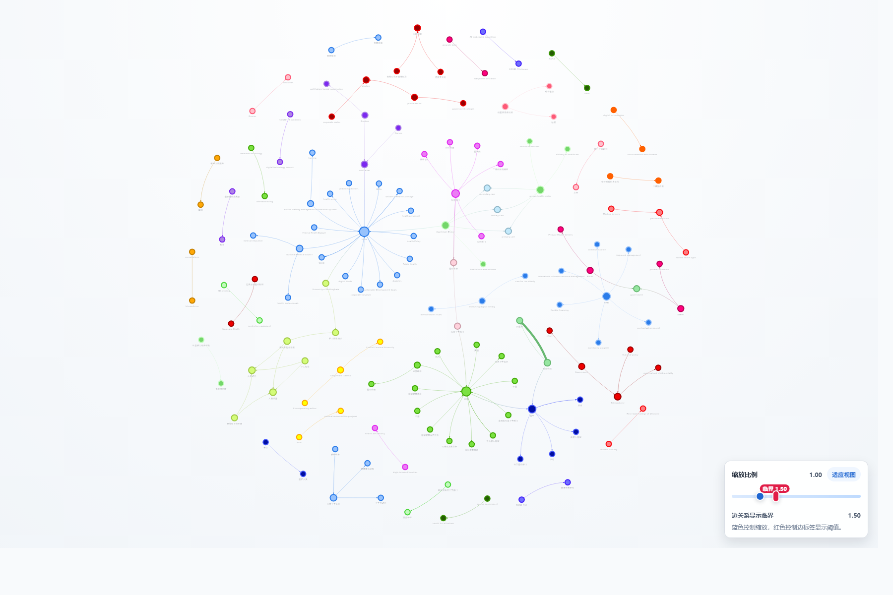

# RelationGraph / 关系织图

把 `pdf`、`txt`、`md` 文档转换成可浏览、可导出的关系图谱。

RelationGraph 是一个面向 Windows 的本地图谱工具。你可以把说明文档、方案文档、资料整理稿直接交给它，它会抽取实体、概念和关系，生成交互式图谱页面，并导出 CSV、HTML、元数据等结果文件。



## 它适合做什么

- 从长文档里快速梳理人物、模块、概念、依赖和上下游关系
- 把非结构化材料整理成可查看、可分享的关系网络
- 在本机优先的前提下，按需切换本地模型或 Ark 云端模型

## 核心特点

- 图谱质量优先，不以“轻量化”牺牲关系抽取效果
- 同时支持本地路线和火山方舟 Ark 云端路线
- 结果可直接预览，也可导出为独立 HTML 和结构化数据
- 运行产物、模型目录、缓存目录不进入 Git 仓库

## 你需要知道的两条路线

| 路线 | 说明 | 适合谁 |
| --- | --- | --- |
| 本地 Ollama | 本机优先，不依赖云端 API，需要你自行准备 Ollama 运行时和模型 | 希望尽量本地化使用，能接受首次准备本地模型 |
| 火山方舟 Ark | 运行时输入 API Key 调用云端 | 想快速开始，或本地模型暂未准备好 |

默认云端配置：

- Model ID: `doubao-seed-1-8-251228`
- Base URL: `https://ark.cn-beijing.volces.com/api/v3`
- Endpoint Path: `/chat/completions`

## 最常见的使用方式

### 方式一：直接用云端 Ark

1. 启动桌面版
2. 切换到 `云端`
3. 输入火山方舟 API Key
4. 选择 `pdf`、`txt`、`md` 文件
5. 点击 `生成知识图谱`

这条路线最省事，不需要你先准备本地模型。

### 方式二：先准备本地模型再使用

0. 先下载 Ollama Windows 压缩包，并解压到程序目录下的 `embedded_runtime/ollama/`
1. 启动桌面版，保持在 `本地`
2. 点击 `下载模型并配置目录`
3. 选择一个模型下载目录
4. 程序会调用你准备好的本地 Ollama，并打开 PowerShell 下载窗口
5. 默认会下载：
   - `qwen3.5:9b`
   - `qwen3.5:4b`
6. 下载完成后回到桌面版
7. 选择文档并生成图谱

### 方式三：你已经有本地模型

0. 先下载 Ollama Windows 压缩包，并解压到程序目录下的 `embedded_runtime/ollama/`
1. 启动桌面版，保持在 `本地`
2. 点击 `已有模型并配置目录`
3. 选择已有模型所在目录
4. 如果状态显示可启动，可以再点击 `启动本地引擎`
5. 如果自动状态不对，也可以点击 `手动启动终端` 直接查看本地引擎日志

当前本地白名单模型为：

- `qwen3.5:9b`
- `qwen3.5:4b`

## 生成完成后会得到什么

每次成功生成后，程序会输出：

- 图谱页面 `graph.html`
- 独立可打开图谱 `graph_standalone.html`
- 文本分块 CSV
- 基础关系 CSV
- 聚合关系 CSV
- 元数据 JSON

图谱页面支持直接本地打开，不依赖浏览器静态服务。

## 快速启动

### 开发运行

1. 安装 Python 依赖

```bash
pip install -r requirements.txt
```

2. 安装前端依赖

```bash
npm install
```

3. 启动桌面开发版

```bash
npm run dev
```

Windows 下也可以直接使用：

```bat
启动桌面开发版.bat
```

### 打包绿色版目录

1. 安装桌面打包依赖

```bash
pip install -r requirements-desktop.txt
```

2. 构建分发目录

```bash
npm run dist:dir
```

输出目录：

```text
desktop-dist/electron/win-unpacked/
```

## 本地路线准备说明

源码仓库和分发版都不内置 Ollama，也不提交模型文件。

如果你要使用本地路线，需要自行准备：

- `ollama-windows-amd64.zip` <https://github.com/ollama/ollama/releases/tag/v0.20.5>
- 本地模型目录

下载后请把 `ollama.exe` 解压到程序目录下的默认位置：

```text
embedded_runtime/ollama/ollama.exe
```

如果你运行的是打包后的绿色目录，这个位置就是：

```text
win-unpacked/embedded_runtime/ollama/ollama.exe
```

## 平台范围

- 当前首发平台：Windows
- 当前主要交付形态：桌面版绿色目录

## 下面是专业/工程信息

### 当前技术结构

- 桌面壳：Electron
- 前端界面：Vue 3 + Vite + TypeScript
- 图谱引擎：Python 常驻 worker
- 核心能力：Python pipeline、本地 Ollama 管理、Ark 云端调用
- 当前桥接语义：结构化请求/响应，renderer 侧对任务与本地 provider 状态使用轻量轮询刷新

### 开发模式说明

开发模式下：

- Vite 提供 renderer 页面
- Electron 启动桌面窗口
- Electron 主进程会自动启动本机 Python worker
- Windows 下默认优先使用仓库内 `.venv`
- 如果仓库内 `.venv` 不存在，开发模式会尝试自动创建并补齐依赖

### 打包说明

如需显式指定打包解释器，可设置：

```bash
set RELATION_GRAPH_PACKAGER_PYTHON=C:\Path\To\python.exe
```

桌面 worker 打包默认只接受标准 CPython `3.9` 到 `3.13`。

`npm run dist:dir` 会先通过 Node 启动脚本寻找可用 Python，再进入 `scripts/build_backend.py` 的解释器选择逻辑，不要求系统 PATH 里必须存在 `python` 命令别名。

如果你只是临时验证，确实要放行其它版本，也必须显式设置：

```bash
set RELATION_GRAPH_ALLOW_UNSUPPORTED_PYTHON=1
```

### 仓库清理原则

仓库长期只保留：

- 核心源码
- 测试代码
- 最小公开文档
- 图谱运行时主静态资源

以下内容不会进入 Git：

- `runtime_state/`
- `data_output/`
- `relation_graph/embedded_runtime/`
- `desktop-dist/`
- `dist/`
- `node_modules/`
- `.build-tools/`
- 缓存、日志、临时目录、模型文件、运行结果

### 测试

Python:

```bash
pip install -r requirements.txt
pytest -q
```

前端:

```bash
npm test
```

构建 renderer:

```bash
npm run build
```

## 致谢

本项目受到 [`rahulnyk/knowledge_graph`](https://github.com/rahulnyk/knowledge_graph) 的启发。
